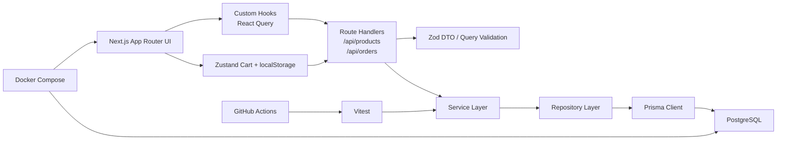

# EMarket

A compact ecommerce project built to demonstrate production-minded engineering practice with `TypeScript + Next.js + PostgreSQL`.

This repository is intentionally scoped. The point is not feature volume. The point is to show that the codebase has a clean shape, real transactional behavior, test coverage on the risky part, containerization, and CI.

## What It Shows

- RESTful API with standardized success/error payloads
- Prisma data model with migrations and seed data
- Transactional order creation with stock deduction and rollback
- Unit tests around the order/inventory flow
- React Query based catalog fetching
- Zustand cart with `localStorage` persistence
- Checkout flow wired to the real order API
- Multi-stage Docker build
- GitHub Actions CI for `lint` + `test`

## Tech Stack

- Next.js 15
- TypeScript
- PostgreSQL 16
- Prisma ORM
- Zod
- Vitest
- React Query
- Zustand
- Tailwind CSS 4
- Docker / Docker Compose
- GitHub Actions

## One-Minute Startup

### Local development

```bash
cp .env.example .env
pnpm install
docker compose up -d db
pnpm db:generate
pnpm db:migrate
pnpm db:seed
pnpm dev
```

Open:

- Storefront: `http://localhost:3000`
- Checkout: `http://localhost:3000/checkout`
- Products API: `http://localhost:3000/api/products`

### Docker

```bash
docker compose up -d --build
```

If port `3000` is occupied on your machine:

```bash
APP_PORT=3001 docker compose up -d --build
```

## Demo Data

Seeded data includes:

- 1 admin user
- 1 demo customer
- 10 products across multiple categories
- 1 starter cart item

The checkout flow uses a fixed demo customer id from [src/lib/demo-user.ts](/D:/_Develop/js/EMarket/src/lib/demo-user.ts) so the front-end can behave like an authenticated app without spending this iteration on auth.

## Architecture



### Project shape

```text
src/
  app/
    api/                  Route handlers
    checkout/             Checkout page
  components/
    checkout/             Checkout UI
    storefront/           Catalog UI
    ui/                   Reusable primitive components
  hooks/                  Data-fetching hooks
  lib/                    Env, Prisma, API helpers, constants
  server/
    repositories/         Database access
    schemas/              Zod request/query schemas
    services/             Business logic
  stores/                 Zustand client state
  types/                  Shared front-end types
prisma/
  migrations/
  schema.prisma
  seed.ts
tests/
  order-service.test.ts
```

## API Contract

All API handlers return the same outer shape:

```json
{
  "success": true,
  "data": {},
  "error": null
}
```

Validation or business failures return:

```json
{
  "success": false,
  "data": null,
  "error": {
    "code": "VALIDATION_ERROR",
    "message": "Request validation failed."
  }
}
```

### Implemented endpoints

- `GET /api/products`
- `POST /api/orders`

### Example

```bash
curl "http://localhost:3000/api/products?page=1&pageSize=6&category=DESK_SETUP"
```

## Engineering Decisions

### Why Prisma

- It gives a fast path from schema to type-safe access.
- Migrations are explicit and easy to review.
- The generated client keeps database access ergonomic without scattering raw SQL everywhere.

### Why transaction-based order creation

Order creation is the only part of this demo where correctness matters more than presentation.

The order service in [src/server/services/order-service.ts](/D:/_Develop/js/EMarket/src/server/services/order-service.ts) uses a database transaction to:

1. Validate the user.
2. Validate product existence and availability.
3. Deduct stock with a conditional update.
4. Create the order and order items.
5. Roll back everything if any step fails.

This is the part that turns the project from "toy CRUD" into a credible engineering sample.

### Why price is stored as `Int`

Prices are stored in cents, not floats. That avoids precision issues and keeps arithmetic deterministic.

### Why UUIDs

The project uses UUIDs instead of auto-incrementing ids so the public-facing resource shape does not leak growth patterns.

### Why soft delete fields exist

`deletedAt` is modeled on `User` and `Product` because real systems often need reversible deletion, auditability, or data retention before physical removal.

## Testing

Run:

```bash
pnpm test
```

Current tests cover:

- successful order creation
- rollback when one product is out of stock
- sequential stock exhaustion behavior

Main test file:

- [tests/order-service.test.ts](/D:/_Develop/js/EMarket/tests/order-service.test.ts)

## Quality Gates

Run everything locally:

```bash
pnpm check
```

That executes:

- ESLint
- Prettier check
- TypeScript typecheck
- Vitest

Git commits are protected by Husky + lint-staged.

## CI

The workflow is in [.github/workflows/ci.yml](/D:/_Develop/js/EMarket/.github/workflows/ci.yml).

On push to `main` and on pull requests targeting `main`, GitHub Actions will:

1. start PostgreSQL
2. install dependencies with pnpm
3. generate the Prisma client
4. apply migrations
5. run lint
6. run tests

## Containerization

The Docker image is a multi-stage build in [Dockerfile](/D:/_Develop/js/EMarket/Dockerfile).

The compose setup in [docker-compose.yml](/D:/_Develop/js/EMarket/docker-compose.yml) runs:

- `db`: PostgreSQL
- `app`: Next.js app container with `prisma migrate deploy` at startup

## Product Scope

Implemented:

- product browsing
- category filtering
- local cart
- checkout form
- transactional order creation
- CI and Docker

Intentionally deferred:

- authentication
- payment integration
- admin dashboard
- image upload pipeline
- order history UI

This is deliberate. The repository optimizes for engineering clarity, not breadth.

## Demo Recording

A short demo video is not checked into this repository yet. The recommended demo path is:

1. open the storefront
2. filter products by category
3. add items to cart
4. refresh the page to show cart persistence
5. go to checkout
6. place an order
7. show the cart clearing and success toast

## Useful Commands

```bash
pnpm dev
pnpm build
pnpm check
pnpm test
pnpm db:migrate
pnpm db:seed
docker compose up -d db
docker compose up -d --build
```

## Notes

- Prisma CLI is configured via [prisma.config.ts](/D:/_Develop/js/EMarket/prisma.config.ts).
- Environment variables are validated in [src/lib/env.ts](/D:/_Develop/js/EMarket/src/lib/env.ts).
- The front-end assumes a demo customer identity instead of implementing auth in this pass.
