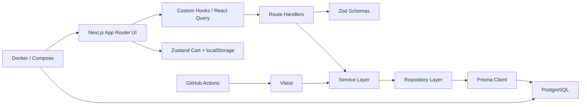

# EMarket

EMarket is a compact ecommerce project built to demonstrate production-oriented engineering practice with `TypeScript`, `Next.js`, and `PostgreSQL`.

The goal of this repository is not to maximize feature count. The goal is to show the shape of a codebase that is intentionally structured, testable, deployable, and easy to reason about.

## Table of Contents

- [Overview](#overview)
- [Core Capabilities](#core-capabilities)
- [Tech Stack](#tech-stack)
- [Architecture](#architecture)
- [Project Structure](#project-structure)
- [Data Model](#data-model)
- [API Design](#api-design)
- [Environment Variables](#environment-variables)
- [Getting Started](#getting-started)
- [Running with Docker](#running-with-docker)
- [Testing and Quality Gates](#testing-and-quality-gates)
- [Continuous Integration](#continuous-integration)
- [Key Engineering Decisions](#key-engineering-decisions)
- [Current Scope](#current-scope)
- [Future Improvements](#future-improvements)

## Overview

This project implements a small but realistic ecommerce workflow:

- browse products
- filter by category
- add items to a local cart
- persist the cart in `localStorage`
- submit an order through a real transactional backend flow

The codebase is organized to highlight engineering judgment:

- API handlers remain thin
- validation is explicit
- business logic is isolated in services
- database access is centralized
- order creation is transactional
- risky behavior is covered by tests
- the application can be built and run in containers

## Core Capabilities

### Backend

- `GET /api/products` with pagination and category filtering
- `POST /api/orders` with transactional inventory handling
- standardized success/error response shape
- Zod-based request validation
- Prisma schema, migrations, and seed data

### Frontend

- storefront page backed by React Query
- reusable UI primitives in a `shadcn/ui`-style structure
- category filters and loading skeletons
- Zustand-powered cart state
- cart persistence with `localStorage`
- checkout form with `react-hook-form`
- toast feedback on order completion

### Engineering

- TypeScript across the stack
- Docker multi-stage build
- Docker Compose for local database and app runtime
- GitHub Actions CI
- Husky + lint-staged for pre-commit checks

## Tech Stack

### Application

- Next.js 15
- React 19
- TypeScript
- Tailwind CSS 4

### Backend and Data

- PostgreSQL 16
- Prisma ORM
- Zod

### Frontend State and Data Fetching

- React Query
- Zustand
- react-hook-form
- sonner

### Quality and Tooling

- Vitest
- ESLint
- Prettier
- Husky
- lint-staged
- pnpm

### Delivery

- Docker
- Docker Compose
- GitHub Actions

## Architecture



### Layer responsibilities

#### UI Layer

Responsible for rendering pages, collecting user input, and dispatching API calls.

Examples:

- [src/components/storefront/storefront-page.tsx](/D:/_Develop/js/EMarket/src/components/storefront/storefront-page.tsx)
- [src/components/checkout/checkout-page.tsx](/D:/_Develop/js/EMarket/src/components/checkout/checkout-page.tsx)

#### Hook / Client State Layer

Responsible for client-side data fetching and local interaction state.

Examples:

- [src/hooks/use-products.ts](/D:/_Develop/js/EMarket/src/hooks/use-products.ts)
- [src/stores/cart-store.ts](/D:/_Develop/js/EMarket/src/stores/cart-store.ts)

#### API Layer

Responsible for HTTP concerns only:

- parse input
- validate request/query payloads
- call application services
- map failures to a consistent response shape

Examples:

- [src/app/api/products/route.ts](/D:/_Develop/js/EMarket/src/app/api/products/route.ts)
- [src/app/api/orders/route.ts](/D:/_Develop/js/EMarket/src/app/api/orders/route.ts)

#### Service Layer

Responsible for business rules and multi-step workflows.

Examples:

- [src/server/services/product-service.ts](/D:/_Develop/js/EMarket/src/server/services/product-service.ts)
- [src/server/services/order-service.ts](/D:/_Develop/js/EMarket/src/server/services/order-service.ts)

#### Repository Layer

Responsible for database access patterns and Prisma query coordination.

Examples:

- [src/server/repositories/product-repository.ts](/D:/_Develop/js/EMarket/src/server/repositories/product-repository.ts)
- [src/server/repositories/order-repository.ts](/D:/_Develop/js/EMarket/src/server/repositories/order-repository.ts)

## Project Structure

```text
src/
  app/
    api/
      orders/
      products/
    checkout/
    globals.css
    layout.tsx
    page.tsx
  components/
    checkout/
    providers/
    storefront/
    ui/
  hooks/
  lib/
  server/
    repositories/
    schemas/
    services/
  stores/
  types/
prisma/
  migrations/
  schema.prisma
  seed.ts
tests/
  order-service.test.ts
.github/
  workflows/
```

## Data Model

The Prisma schema is defined in [prisma/schema.prisma](/D:/_Develop/js/EMarket/prisma/schema.prisma).

### Main entities

- `User`
- `Product`
- `CartItem`
- `Order`
- `OrderItem`

### Important modeling decisions

#### Prices are stored as integers

All money values are stored as `Int` in cents rather than `Float`.

Example:

- `12900` means `129.00`

This avoids floating-point precision issues during pricing and order total calculations.

#### UUIDs are used for identifiers

All major entities use UUIDs instead of auto-incrementing integers. This avoids exposing business growth patterns through predictable ids.

#### Soft-delete fields exist on key entities

`User` and `Product` include `deletedAt` so the design can evolve toward retention, auditability, and reversible removal.

#### Orders store a price snapshot

`OrderItem.priceAtPurchase` persists the product price at purchase time. That ensures order history remains accurate even if product prices change later.

#### Indexes and uniqueness constraints are explicit

Examples:

- product name index for catalog search/filter evolution
- `(userId, createdAt)` index on orders for order history access
- unique `(userId, productId)` on cart items

## API Design

### Response format

All API endpoints return the same envelope.

Successful response:

```json
{
  "success": true,
  "data": {},
  "error": null
}
```

Error response:

```json
{
  "success": false,
  "data": null,
  "error": {
    "code": "VALIDATION_ERROR",
    "message": "Request validation failed."
  }
}
```

This makes front-end handling predictable and avoids leaking internal exception details.

### Implemented endpoints

#### `GET /api/products`

Supports:

- `page`
- `pageSize`
- `category`

Example:

```bash
curl "http://localhost:3000/api/products?page=1&pageSize=6&category=DESK_SETUP"
```

#### `POST /api/orders`

Creates an order using a database transaction.

Example payload:

```json
{
  "userId": "22222222-2222-2222-2222-222222222222",
  "shippingAddress": "Demo Customer · 48 Harbour Street, Sydney NSW 2000",
  "items": [
    {
      "productId": "PRODUCT_UUID",
      "quantity": 1
    }
  ]
}
```

## Environment Variables

Environment variables are validated in [src/lib/env.ts](/D:/_Develop/js/EMarket/src/lib/env.ts).

Example file: [.env.example](/D:/_Develop/js/EMarket/.env.example)

### Variables

- `DATABASE_URL`: PostgreSQL connection string
- `NODE_ENV`: `development`, `test`, or `production`
- `PORT`: application port inside the process/container
- `APP_PORT`: host port mapping used by Docker Compose

For this Windows environment, the development server defaults to `127.0.0.1:4500` because the `3000-3001` range is reserved by the operating system.

## Getting Started

### Prerequisites

- Node.js 22+
- pnpm 10+
- Docker Desktop or a compatible Docker runtime

### Install and run locally

```bash
cp .env.example .env
pnpm install
docker compose up -d db
pnpm db:generate
pnpm db:migrate
pnpm db:seed
pnpm dev
```

Open:

- Storefront: `http://127.0.0.1:4500`
- Checkout: `http://127.0.0.1:4500/checkout`

### Demo user assumption

Authentication is intentionally deferred in this iteration. The checkout flow uses a fixed demo customer id from [src/lib/demo-user.ts](/D:/_Develop/js/EMarket/src/lib/demo-user.ts).

This keeps focus on ecommerce behavior instead of auth plumbing.

## Running with Docker

### Build and run the full stack

```bash
docker compose up -d --build
```

### If port 3000 is already in use

```bash
APP_PORT=3001 docker compose up -d --build
```

### What the Docker setup does

- builds the app using a multi-stage Dockerfile
- starts PostgreSQL
- waits for the database health check
- applies Prisma migrations with `prisma migrate deploy`
- starts the Next.js app in production mode

Main files:

- [Dockerfile](/D:/_Develop/js/EMarket/Dockerfile)
- [docker-compose.yml](/D:/_Develop/js/EMarket/docker-compose.yml)

## Testing and Quality Gates

### Run all checks

```bash
pnpm check
```

This runs:

- ESLint
- Prettier check
- TypeScript typecheck
- Vitest

### Run tests only

```bash
pnpm test
```

Current tests focus on the highest-risk path: order creation and inventory behavior.

Test file:

- [tests/order-service.test.ts](/D:/_Develop/js/EMarket/tests/order-service.test.ts)

### What is covered

- successful order creation when stock is available
- rollback when one item in the order is out of stock
- behavior when stock is exhausted across sequential attempts

## Continuous Integration

The CI workflow lives in [.github/workflows/ci.yml](/D:/_Develop/js/EMarket/.github/workflows/ci.yml).

It runs on:

- push to `main`
- pull requests targeting `main`

### CI steps

1. checkout repository
2. install pnpm
3. install Node.js
4. install dependencies with lockfile
5. generate Prisma client
6. apply migrations
7. run lint
8. run tests

The workflow uses a PostgreSQL service container so tests execute against a real database-backed environment.

## Key Engineering Decisions

### Why Next.js instead of splitting front-end and back-end repos

For a project of this size, a single repository keeps development fast while still allowing good separation between UI, API, services, and persistence layers.

### Why Zod

Zod provides runtime validation and type inference from the same schema definitions. This reduces drift between what the API expects and what the application assumes.

### Why React Query

Product listing is a server-backed data problem, not a local component state problem. React Query gives a better default model for request caching, loading states, and future pagination/filter growth.

### Why Zustand for cart state

The cart is local, session-oriented state that needs to survive refreshes. Zustand with persistence is simpler and more direct than introducing a heavier state solution.

### Why the order flow is transaction-first

This is the most important engineering decision in the repository.

The order workflow in [src/server/services/order-service.ts](/D:/_Develop/js/EMarket/src/server/services/order-service.ts):

1. validates the user
2. validates product availability
3. conditionally decrements stock
4. creates the order
5. creates order items
6. rolls back everything on failure

This prevents partial writes and keeps stock/order state consistent.

### Why the API layer stays thin

Route handlers should not become the business layer. They should translate HTTP into validated inputs, delegate to services, and convert failures into stable responses.

## Current Scope

### Included

- product browsing
- category filtering
- persisted local cart
- checkout flow
- transactional order creation
- Docker build/runtime setup
- CI workflow
- unit tests around the risky business logic

### Intentionally excluded

- authentication and authorization
- payment provider integration
- admin dashboard
- image upload pipeline
- coupon engine
- background jobs
- email notifications
- order history page

These omissions are deliberate. They keep the project focused on engineering quality rather than surface area.

## Future Improvements

If this project were continued, the next meaningful steps would be:

- add authentication and map orders to real sessions
- add product search and sorting
- add optimistic cart updates with stock refresh
- expose order history and order detail pages
- add integration tests around API routes
- add coverage reporting to CI
- add observability hooks for request tracing and structured logs
- add payment orchestration and webhook handling

## Notes

- Prisma CLI is configured via [prisma.config.ts](/D:/_Develop/js/EMarket/prisma.config.ts)
- seed data is defined in [prisma/seed.ts](/D:/_Develop/js/EMarket/prisma/seed.ts)
- environment validation is centralized in [src/lib/env.ts](/D:/_Develop/js/EMarket/src/lib/env.ts)
- the front-end assumes a demo customer instead of a full authentication system in this pass
